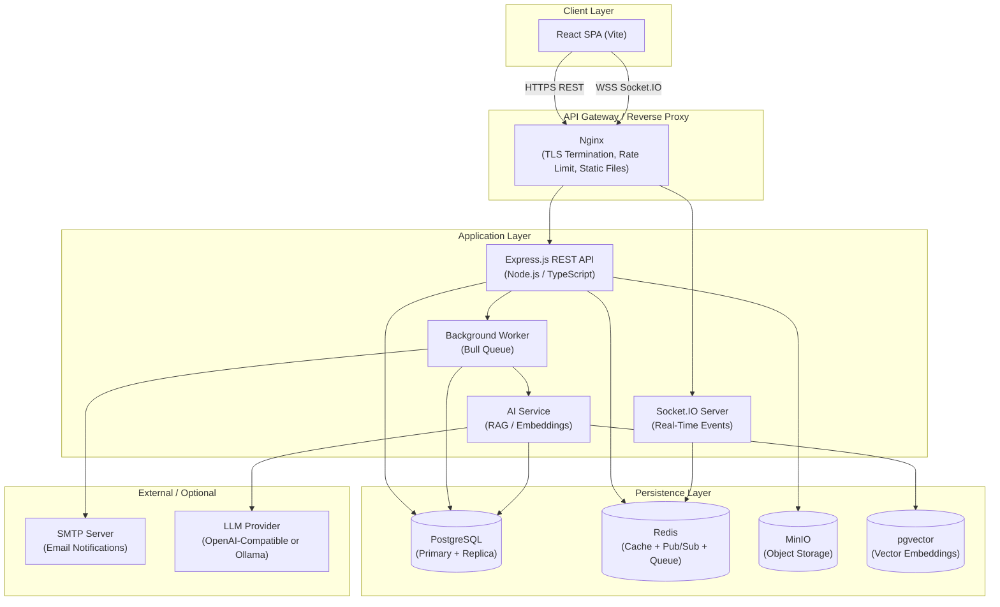
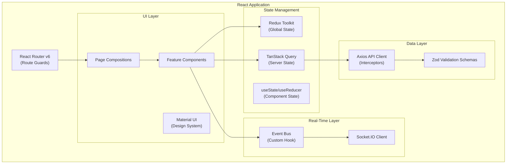
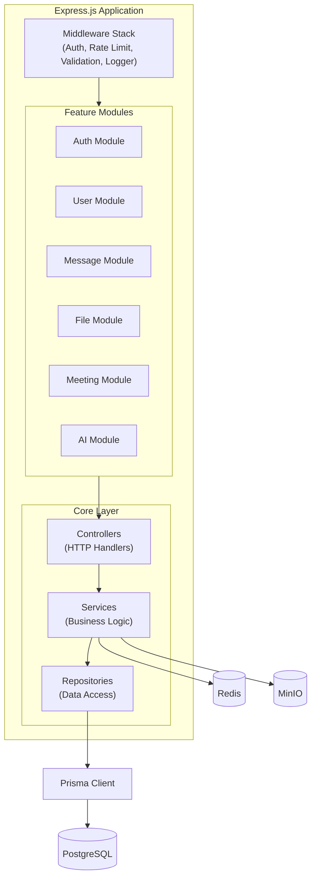
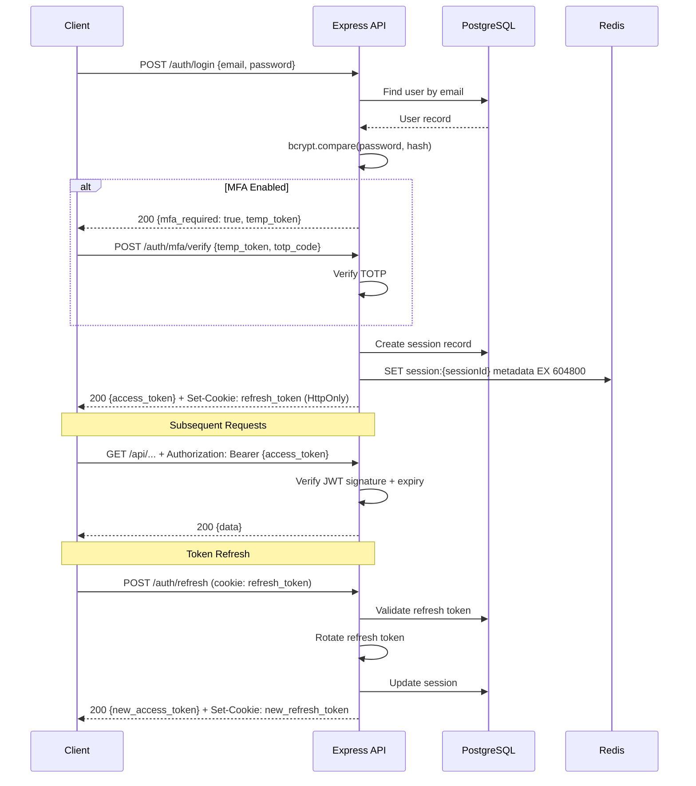
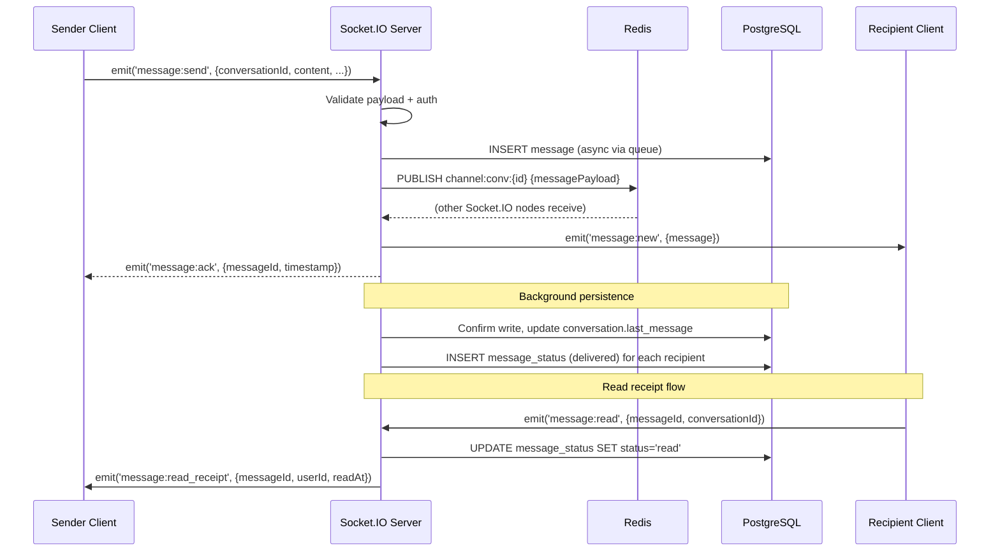
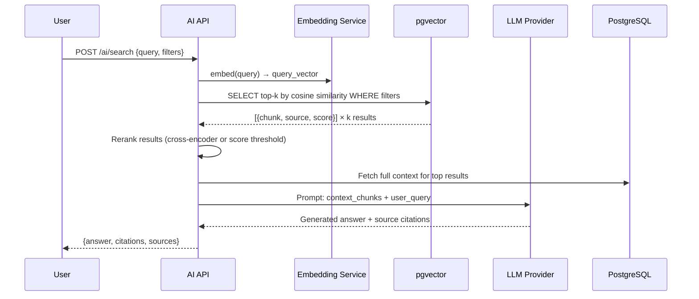
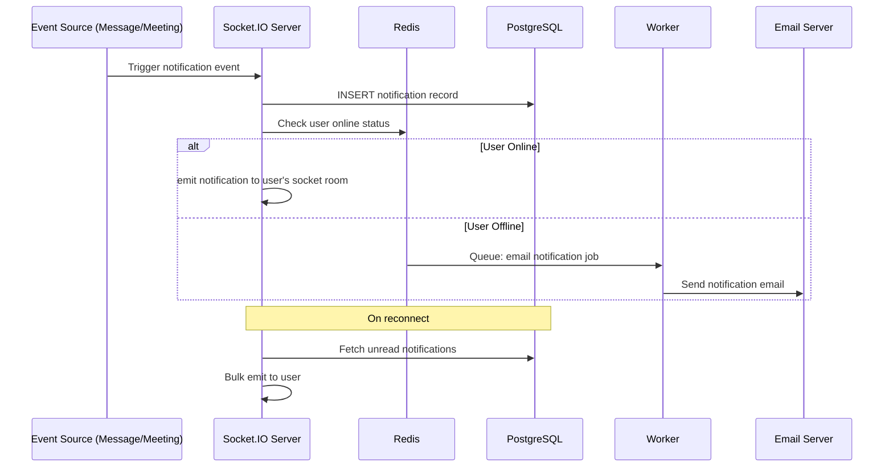
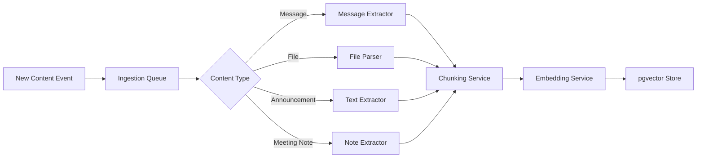

# PLAN.md — Enterprise Internal Communication & Collaboration Platform
## Architecture & Implementation Blueprint v1.0

> **Document Purpose:** This is the authoritative implementation blueprint for the Enterprise Internal Communication & Collaboration Platform. It is intended to be used by Cursor AI and engineering teams as the primary reference for all development phases. No source code is included — this document defines *what* to build, *why* decisions were made, and *how* the system should be structured at every layer.

---

# Table of Contents

1. [Executive Summary](#1-executive-summary)
2. [Product Requirements Document](#2-product-requirements-document)
3. [Non-Functional Requirements](#3-non-functional-requirements)
4. [System Architecture](#4-system-architecture)
5. [Frontend Architecture](#5-frontend-architecture)
6. [Backend Architecture](#6-backend-architecture)
7. [Database Design](#7-database-design)
8. [PostgreSQL Optimization Strategy](#8-postgresql-optimization-strategy)
9. [Redis Strategy](#9-redis-strategy)
10. [Socket.IO Design](#10-socketio-design)
11. [API Design](#11-api-design)
12. [Security Architecture](#12-security-architecture)
13. [AI Architecture](#13-ai-architecture)
14. [Testing Strategy](#14-testing-strategy)
15. [Monitoring & Observability](#15-monitoring--observability)
16. [Development Roadmap](#16-development-roadmap)
17. [Production Readiness Checklist](#17-production-readiness-checklist)
18. [Future Roadmap](#18-future-roadmap)

---

# 1. Executive Summary

## Vision

Build a self-hosted, enterprise-grade internal communication and collaboration platform that gives organizations full ownership of their data, conversations, files, and AI capabilities — without depending on third-party SaaS vendors like Slack, Microsoft Teams, or Google Chat.

The platform serves as the central nervous system for organizational communication: enabling real-time messaging, structured channels, file collaboration, meetings, AI-powered knowledge retrieval, and administrative oversight — all within a secure, auditable, scalable system.

## Goals

| Goal | Description |
|------|-------------|
| **Data Sovereignty** | All organizational data — messages, files, users, AI embeddings — remains on-premise or within the organization's own cloud environment |
| **Real-Time Communication** | Sub-100ms message delivery for concurrent users via WebSocket architecture |
| **AI-Augmented Productivity** | RAG-based semantic search across messages, files, announcements, and meeting notes |
| **Enterprise Security** | RBAC, MFA, audit logging, encrypted storage, token-based auth with refresh lifecycle |
| **Scalability-Ready** | Architecture supports horizontal scaling from Day 1 even if initial deployment is local |
| **Developer Extensibility** | Module-based backend and pluggable AI layer so new capabilities can be added without rearchitecting |

## Scope

**In Scope:**
- Authentication system (JWT + Refresh Tokens + MFA + Device Tracking)
- User management with profile, department, directory, org hierarchy
- Direct Messages, Group Chats, Department Channels
- Real-time presence (online/offline/away/busy), typing indicators, read receipts
- File management (upload/download/preview/versioning) via MinIO
- Meeting scheduling, invitations, notes, attendance
- Notifications (mention, DM, meeting, announcement)
- Company/department/emergency announcements
- AI layer: RAG search, chat summarization, meeting summarization
- Analytics dashboard for admins
- Complete audit log system
- Admin panel for user/role/permission management

**Out of Scope (Phase 1):**
- Video/audio calling (WebRTC) — planned for Phase 4
- Mobile native apps — API-first design enables this later
- SSO/SAML/OAuth provider federation — future roadmap
- External guest access — future roadmap

## Business Value

Organizations currently pay $7–$25/user/month for SaaS communication tools. A self-hosted platform eliminates recurring SaaS costs while delivering stronger data control, custom AI integration, and no vendor lock-in. For a 500-person company, annual SaaS savings can reach $75,000–$150,000 while gaining full auditability and AI customization unavailable in commercial platforms.

---

# 2. Product Requirements Document

## 2.1 Authentication Module

### Functional Requirements

**FR-AUTH-001:** The system SHALL support email/password-based authentication with bcrypt-hashed passwords (minimum cost factor 12).

**FR-AUTH-002:** The system SHALL issue short-lived JWT access tokens (15-minute expiry) and long-lived refresh tokens (7-day expiry, stored in HttpOnly cookies).

**FR-AUTH-003:** The system SHALL support TOTP-based MFA (compatible with Google Authenticator, Authy) and backup recovery codes.

**FR-AUTH-004:** The system SHALL track active sessions per user, storing device metadata (user-agent, IP, device fingerprint) with the ability to revoke individual sessions.

**FR-AUTH-005:** The system SHALL implement forgot-password flow via time-limited email tokens (1-hour expiry, single-use).

**FR-AUTH-006:** The system SHALL lock accounts after 5 consecutive failed login attempts with exponential backoff.

### User Stories

- *As an employee*, I want to log in with my email and password so I can access the platform securely.
- *As an employee*, I want to enable MFA on my account so that unauthorized access is prevented even if my password is compromised.
- *As an employee*, I want to view and revoke my active sessions so I can remove access from devices I no longer use.
- *As a system admin*, I want to force-logout a user from all devices so I can respond to security incidents.

### Acceptance Criteria

- Login with correct credentials returns access token and sets refresh token cookie within 500ms
- Failed login increments attempt counter; after 5 failures, login is blocked for 15 minutes
- MFA setup displays QR code compatible with TOTP apps; verification requires correct 6-digit code
- Session list shows device, IP, last active time; revoking a session invalidates that refresh token immediately
- Password reset email is delivered within 60 seconds; reset link expires after 60 minutes or first use

---

## 2.2 User Management Module

### Functional Requirements

**FR-USER-001:** Each user SHALL have a profile containing: full name, display name, avatar, job title, department, phone, bio, skills (tags), location, timezone.

**FR-USER-002:** The system SHALL maintain an employee directory searchable by name, department, skill, and job title.

**FR-USER-003:** The system SHALL support an organization hierarchy model: Org > Department > Team > User.

**FR-USER-004:** Admins SHALL be able to deactivate users (soft delete), preserving message history.

**FR-USER-005:** Profile pictures SHALL be stored in MinIO with configurable size limits (default 5MB); thumbnails auto-generated at 48px, 96px, 256px.

### User Stories

- *As an employee*, I want to view a colleague's profile so I can see their role, department, and contact info.
- *As an employee*, I want to search the employee directory by skill so I can find subject matter experts.
- *As an HR admin*, I want to assign users to departments and set reporting hierarchies so the org structure is reflected in the platform.

### Acceptance Criteria

- Profile updates reflect immediately in the UI without full page reload
- Directory search returns results within 300ms for datasets up to 10,000 users
- Deactivated users appear as "Deactivated" in message history; cannot log in; do not appear in directory

---

## 2.3 Communication Module

### Direct Messages

**FR-DM-001:** Users SHALL be able to initiate 1:1 conversations with any active user.

**FR-DM-002:** Messages SHALL support: plain text, markdown rendering, emoji, file attachments, code blocks.

**FR-DM-003:** Messages SHALL support reactions (emoji), editing (with edit history), deletion (soft-delete showing "Message deleted"), replies (threaded), forwarding to another conversation, and pinning.

**FR-DM-004:** The system SHALL maintain read receipt state: sent, delivered, read — per recipient per message.

**FR-DM-005:** Typing indicators SHALL appear when a participant is actively typing and disappear after 3 seconds of inactivity or message send.

### Group Chat

**FR-GRP-001:** Users SHALL be able to create groups with a name, description, and avatar.

**FR-GRP-002:** Groups SHALL support roles: Owner, Admin, Member. Owner can transfer ownership. Admins can add/remove members and manage settings. Members can send messages.

**FR-GRP-003:** Group admins SHALL be able to restrict who can send messages (admin-only mode for announcements).

### Department Channels

**FR-CHAN-001:** Channels are associated with a department and created by department admins or system admins.

**FR-CHAN-002:** Channels SHALL support public (all department members auto-joined) and private (invite-only) visibility.

**FR-CHAN-003:** A default "General" channel SHALL exist for each department and cannot be deleted.

**FR-CHAN-004:** Channel messages support the same feature set as DMs: reactions, editing, deletion, replies, pinning, forwarding.

---

## 2.4 File Management Module

**FR-FILE-001:** The system SHALL support upload of: PDF, DOCX, XLSX, PPTX, JPEG, PNG, GIF, MP4, MOV, ZIP (max 100MB per file by default, configurable).

**FR-FILE-002:** Files SHALL be stored in MinIO with unique object keys; database stores metadata (name, size, MIME type, uploader, upload time, version).

**FR-FILE-003:** The system SHALL maintain file version history: re-uploading a file with the same name in the same context creates a new version; all versions remain accessible.

**FR-FILE-004:** File access SHALL be permission-controlled: files uploaded to a private channel are only accessible to channel members.

**FR-FILE-005:** The system SHALL generate presigned MinIO URLs for file downloads with a configurable TTL (default 15 minutes) to prevent unauthorized sharing of download links.

**FR-FILE-006:** PDF, images, and Office documents (via LibreOffice conversion or similar) SHALL support inline preview.

---

## 2.5 Meetings Module

**FR-MTG-001:** Users SHALL be able to schedule meetings with: title, description, start time, end time, recurrence (once, daily, weekly, monthly), invited participants.

**FR-MTG-002:** Invitees SHALL receive notifications and be able to accept, decline, or mark tentative.

**FR-MTG-003:** Meeting notes SHALL be a collaborative text document (rich text) editable by the organizer and note-designated participants.

**FR-MTG-004:** Attendance SHALL be tracked per meeting: organizer marks attendance post-meeting, or participants self-check-in.

**FR-MTG-005:** Calendar view SHALL show user's meetings by day/week/month.

---

## 2.6 Notifications Module

**FR-NOTIF-001:** The system SHALL generate notifications for: @mention in any message, new DM received, new group message (if notifications enabled), meeting invitation, meeting reminder (15 min before), new announcement.

**FR-NOTIF-002:** Notifications SHALL be delivered in real-time via Socket.IO when the user is online.

**FR-NOTIF-003:** Missed notifications (user offline) SHALL be persisted and delivered upon reconnect.

**FR-NOTIF-004:** Users SHALL be able to configure per-channel and per-group notification preferences: all messages, mentions only, muted.

**FR-NOTIF-005:** Notification count badges SHALL update in real-time across all active browser tabs (via BroadcastChannel API).

---

## 2.7 Announcements Module

**FR-ANN-001:** System admins SHALL be able to post company-wide announcements visible to all users.

**FR-ANN-002:** Department admins SHALL be able to post department-scoped announcements.

**FR-ANN-003:** System admins SHALL be able to post emergency announcements that trigger a modal overlay for all currently online users.

**FR-ANN-004:** Announcements support rich text, file attachments, and expiry dates.

**FR-ANN-005:** Announcement read tracking: system records who has acknowledged/read each announcement.

---

## 2.8 AI Module

**FR-AI-001:** The system SHALL provide semantic search across messages, files (extracted text), announcements, and meeting notes via a RAG pipeline.

**FR-AI-002:** The system SHALL generate conversation summaries on demand for direct messages and channels.

**FR-AI-003:** The system SHALL generate meeting summaries from meeting notes.

**FR-AI-004:** The AI layer SHALL support both local LLM (via Ollama / LM Studio) and OpenAI-compatible remote APIs, switchable via configuration.

**FR-AI-005:** AI search queries SHALL return citations (source document, timestamp, channel/user context).

---

# 3. Non-Functional Requirements

## 3.1 Performance

| Metric | Target |
|--------|--------|
| API P95 response time | < 200ms for read endpoints |
| Message delivery latency | < 100ms (Socket.IO, same datacenter) |
| File upload throughput | 50MB file < 10 seconds on LAN |
| Search query response | < 500ms for semantic search (RAG) |
| Page initial load (TTI) | < 2 seconds on LAN |
| Concurrent Socket.IO connections | 2,000+ without degradation |
| Database query P99 | < 50ms for indexed queries |

**Design Decision:** The 15-minute JWT expiry balances security and performance. Shorter expiry increases refresh token chatter; longer expiry increases the attack window for token theft. 15 minutes is the industry standard for high-security applications.

## 3.2 Scalability

- Backend is stateless (all session/presence state in Redis); horizontal scaling via load balancer is straightforward.
- Socket.IO uses Redis Pub/Sub adapter, allowing multiple Socket.IO server instances to coordinate presence and message delivery.
- PostgreSQL designed with read replicas in mind: write to primary, read from replicas for analytics/search.
- MinIO supports distributed mode natively; local single-node deployment upgrades to distributed with no application code changes.
- Database tables for messages and audit_logs are designed for time-based partitioning (monthly partitions) to maintain query performance as data grows.

## 3.3 Security

- All HTTP traffic SHALL be served over TLS in production (Nginx termination).
- Passwords hashed with bcrypt (cost 12); never stored in plaintext or reversibly encrypted.
- JWT secrets stored in environment variables, rotatable without restart via JWKS rotation strategy.
- All user-facing inputs validated with Zod schemas at both API boundary and frontend.
- SQL injection prevented by Prisma parameterized queries exclusively; raw SQL only in migrations.
- File uploads scanned for MIME type spoofing (check magic bytes, not just Content-Type header).
- Rate limiting applied at: login (5 req/min), registration (3 req/min), password reset (3 req/15min), general API (300 req/min per user).
- Sensitive operations (MFA disable, password change, session revoke) require re-authentication.

## 3.4 Reliability

- Target: 99.9% uptime (8.7 hours/year downtime budget) for on-premise deployment.
- Database: WAL-based streaming replication to at least one hot standby.
- Redis: Sentinel mode for high availability; AOF persistence enabled.
- MinIO: EC (Erasure Coding) mode recommended for production to survive disk failures.
- Graceful degradation: if Redis is unavailable, Socket.IO falls back to single-server mode; AI search falls back to PostgreSQL full-text search.

## 3.5 Availability

- Zero-downtime deployments via rolling updates (Docker Compose → Kubernetes migration path).
- Database migrations run before code deployment; migrations must be backward-compatible (no destructive changes in forward migration).
- Health check endpoints (`/health`, `/health/db`, `/health/redis`) for load balancer probing.

## 3.6 Maintainability

- Monorepo structure with `packages/` for shared types between frontend and backend.
- All API contracts defined with Zod; shared schemas published to `packages/shared`.
- Strict TypeScript (`strict: true`, `noUncheckedIndexedAccess: true`) across all packages.
- Automated linting (ESLint), formatting (Prettier), and commit message validation (Commitlint).
- All business logic isolated in service layer; controllers are thin orchestrators.
- Environment configuration via `.env` files with documented `.env.example`; never hardcoded values.

## 3.7 Observability

- Structured JSON logging (Winston/Pino) with log levels: error, warn, info, debug.
- OpenTelemetry traces for all API requests and Socket.IO event handling.
- Prometheus metrics endpoint (`/metrics`) for Grafana dashboards.
- Alerting on: error rate > 1%, P95 latency > 500ms, disk usage > 80%, failed auth spike.

## 3.8 Compliance Considerations

- GDPR: User data export endpoint; account deletion endpoint (hard delete with 30-day grace period).
- Data retention: Configurable message retention per channel (default: indefinite; admin-configurable).
- Audit logs: Immutable audit trail for all administrative actions; 1-year retention default.
- Encryption at rest: MinIO server-side encryption (SSE) and PostgreSQL TDE (Transparent Data Encryption) guidance provided in deployment docs.

---

# 4. System Architecture

## 4.1 High-Level Architecture



**Design Decision:** Nginx sits in front of all traffic for TLS termination, static file serving, and request routing. This keeps the Node.js servers focused on business logic and allows independent scaling of API and Socket.IO tiers. The Socket.IO server is separated logically (can be deployed as a separate process) to allow independent horizontal scaling of the real-time tier — messaging load patterns differ significantly from REST API load patterns.

## 4.2 Frontend Architecture



## 4.3 Backend Architecture



## 4.4 Authentication Flow



## 4.5 Message Flow



## 4.6 AI Search Flow



## 4.7 Notification Flow



---

# 5. Frontend Architecture

## 5.1 Design Philosophy

**State Segregation:** The frontend uses three distinct state domains:
- **Server state** (TanStack Query): remote data with caching, background refresh, optimistic updates
- **Global UI state** (Redux Toolkit): auth state, active conversation, sidebar state, notification count, theme
- **Local component state** (useState/useReducer): form values, modal visibility, UI transitions

**Why TanStack Query + Redux?** TanStack Query eliminates 80% of manual data fetching boilerplate and provides stale-while-revalidate caching out of the box. Redux is reserved for truly global UI state that doesn't belong to any single component tree. Using Redux for server state (the classic mistake) leads to cache invalidation complexity; TanStack Query handles this automatically.

## 5.2 Folder Structure

```
frontend/
├── public/
│   └── icons/, fonts/, manifest.json
├── src/
│   ├── app/
│   │   ├── App.tsx                    # Root component, providers
│   │   ├── router.tsx                 # Route definitions + guards
│   │   └── providers.tsx              # All context providers
│   │
│   ├── assets/
│   │   └── images/, icons/
│   │
│   ├── components/
│   │   ├── common/                    # Pure UI primitives
│   │   │   ├── Avatar/
│   │   │   ├── Badge/
│   │   │   ├── Button/
│   │   │   ├── ConfirmDialog/
│   │   │   ├── EmptyState/
│   │   │   ├── ErrorBoundary/
│   │   │   ├── FilePreview/
│   │   │   ├── InfiniteScroll/
│   │   │   ├── LoadingSpinner/
│   │   │   ├── MarkdownRenderer/
│   │   │   ├── Modal/
│   │   │   ├── RichTextEditor/
│   │   │   ├── SearchInput/
│   │   │   └── VirtualList/
│   │   │
│   │   ├── layout/
│   │   │   ├── AppShell/              # Main layout wrapper
│   │   │   ├── Sidebar/               # Left navigation
│   │   │   ├── TopBar/                # Header bar
│   │   │   └── RightPanel/            # Context panel
│   │   │
│   │   └── features/                  # Feature-specific components
│   │       ├── auth/
│   │       ├── chat/
│   │       │   ├── MessageList/
│   │       │   ├── MessageItem/
│   │       │   ├── MessageInput/
│   │       │   ├── MessageReactions/
│   │       │   ├── ThreadPanel/
│   │       │   ├── TypingIndicator/
│   │       │   └── ReadReceipts/
│   │       ├── channels/
│   │       ├── files/
│   │       ├── meetings/
│   │       ├── notifications/
│   │       ├── announcements/
│   │       ├── ai/
│   │       │   ├── SearchModal/
│   │       │   └── SummaryPanel/
│   │       ├── admin/
│   │       └── analytics/
│   │
│   ├── hooks/
│   │   ├── useSocket.ts               # Socket.IO connection + event handlers
│   │   ├── usePresence.ts             # Online status management
│   │   ├── useTyping.ts               # Typing indicator logic
│   │   ├── useNotifications.ts        # Notification subscription
│   │   ├── useInfiniteMessages.ts     # Paginated message loading
│   │   ├── useAuth.ts                 # Auth state + token refresh
│   │   ├── usePermissions.ts          # RBAC permission checks
│   │   └── useUpload.ts               # File upload with progress
│   │
│   ├── pages/
│   │   ├── auth/
│   │   │   ├── LoginPage.tsx
│   │   │   ├── MFAPage.tsx
│   │   │   └── ResetPasswordPage.tsx
│   │   ├── chat/
│   │   │   ├── DirectMessagePage.tsx
│   │   │   ├── GroupChatPage.tsx
│   │   │   └── ChannelPage.tsx
│   │   ├── meetings/
│   │   │   ├── CalendarPage.tsx
│   │   │   └── MeetingDetailPage.tsx
│   │   ├── files/
│   │   │   └── FilesPage.tsx
│   │   ├── announcements/
│   │   │   └── AnnouncementsPage.tsx
│   │   ├── profile/
│   │   │   ├── ProfilePage.tsx
│   │   │   └── SettingsPage.tsx
│   │   ├── directory/
│   │   │   └── DirectoryPage.tsx
│   │   ├── admin/
│   │   │   ├── AdminDashboard.tsx
│   │   │   ├── UserManagement.tsx
│   │   │   ├── RolesPage.tsx
│   │   │   └── AuditPage.tsx
│   │   └── analytics/
│   │       └── AnalyticsPage.tsx
│   │
│   ├── services/
│   │   ├── api/
│   │   │   ├── client.ts              # Axios instance + interceptors
│   │   │   ├── auth.api.ts
│   │   │   ├── users.api.ts
│   │   │   ├── messages.api.ts
│   │   │   ├── channels.api.ts
│   │   │   ├── files.api.ts
│   │   │   ├── meetings.api.ts
│   │   │   ├── notifications.api.ts
│   │   │   ├── announcements.api.ts
│   │   │   └── ai.api.ts
│   │   └── socket/
│   │       ├── socket.client.ts       # Socket.IO client singleton
│   │       ├── socket.events.ts       # Event name constants
│   │       └── socket.handlers.ts     # Event handler registry
│   │
│   ├── store/
│   │   ├── index.ts                   # Store configuration
│   │   ├── slices/
│   │   │   ├── authSlice.ts
│   │   │   ├── uiSlice.ts             # Sidebar state, modals, theme
│   │   │   ├── presenceSlice.ts       # Online user map
│   │   │   └── notificationSlice.ts   # Unread counts
│   │   └── middleware/
│   │       └── socketMiddleware.ts    # Redux ↔ Socket bridge
│   │
│   ├── types/
│   │   ├── api.types.ts               # API response shapes
│   │   ├── message.types.ts
│   │   ├── user.types.ts
│   │   └── socket.types.ts
│   │
│   ├── utils/
│   │   ├── date.utils.ts
│   │   ├── file.utils.ts
│   │   ├── format.utils.ts
│   │   └── permissions.utils.ts
│   │
│   └── config/
│       ├── constants.ts
│       ├── routes.ts
│       └── theme.ts
│
├── index.html
├── vite.config.ts
├── tsconfig.json
└── package.json
```

## 5.3 Routing Strategy

Routes are defined with React Router v6 using nested layouts. Route guards are implemented as wrapper components that check auth state from Redux.

**Route Categories:**
- **Public routes:** `/login`, `/forgot-password`, `/reset-password/:token` — redirect authenticated users to `/`
- **Protected routes:** All others — redirect unauthenticated users to `/login`
- **Admin routes:** `/admin/*` — requires `role: ADMIN` or `role: SUPER_ADMIN`; shows 403 for insufficient permissions

**Lazy Loading:** All page-level components are loaded via `React.lazy()` + `Suspense`. Route-based code splitting reduces initial bundle size. Common components (AppShell, Sidebar) are eagerly loaded.

## 5.4 State Management Strategy

| State Type | Store | Rationale |
|-----------|-------|-----------|
| Auth user, tokens | Redux | Global, synchronous, persisted to localStorage |
| UI state (sidebar open, active channel) | Redux | Shared across unrelated components |
| Server data (messages, users, channels) | TanStack Query | Automatic caching, deduplication, background refresh |
| Form values | React Hook Form | Local to form, not needed globally |
| Presence map (userId → status) | Redux | Updated via Socket.IO, referenced by many components |
| Notification count | Redux | Badge in sidebar, updated via Socket.IO |

**Optimistic Updates:** Message sending uses TanStack Query's `useMutation` with `onMutate` to optimistically insert the message into the local cache before server confirmation. `onError` rolls back. This gives perceived zero-latency message sending.

## 5.5 Real-Time Layer

The Socket.IO client is initialized once as a singleton after successful authentication. The client attaches the JWT access token in the `auth` handshake parameter.

`useSocket` hook:
- Manages connection lifecycle (connect on auth, disconnect on logout)
- Exposes `emit` and `on`/`off` wrappers with TypeScript event typing
- Handles reconnection events: on reconnect, fetches missed messages and notifications via REST

`usePresence` hook:
- Subscribes to `presence:update` events
- Dispatches to `presenceSlice` in Redux
- Sends own status updates debounced (300ms) on window focus/blur/activity

## 5.6 Infinite Scroll for Messages

Messages are loaded using **bi-directional cursor-based pagination**:
- Initial load: last 50 messages in the conversation
- Scroll to top: load older messages (backward cursor)
- New messages arrive via Socket.IO (no polling)
- Virtual scrolling (`react-virtual`) renders only visible messages; critical for conversations with thousands of messages

**Why cursor-based not offset-based?** Offset pagination breaks when new messages are inserted: loading "page 2" after a new message shifts all rows, causing duplicates. Cursor-based uses the message timestamp/ID as the cursor, making it stable.

## 5.7 Form Handling

All forms use React Hook Form + Zod resolver. Form schemas are imported from `packages/shared` to ensure client and server validate identical rules.

```
Form structure:
- useForm({ resolver: zodResolver(schema) })
- Controller wrappers for MUI components
- FormErrorMessage component for field-level errors
- Global form error displayed in Alert component
- Submit button disabled during submission
```

## 5.8 Theme Management

MUI theme is configured in `src/config/theme.ts` with:
- Light and dark mode support (stored in user preferences, persisted in localStorage)
- Custom color palette matching brand guidelines
- Typography scale with Inter (body) + custom display font
- Component overrides for consistent spacing and border radius
- Responsive breakpoints for tablet/desktop (no mobile-first — enterprise desktop focus)

---

# 6. Backend Architecture

## 6.1 Design Philosophy

The backend follows a layered architecture: **Controller → Service → Repository**. Each layer has a single responsibility:

- **Controller:** Parse HTTP request, validate input with Zod, call service, format HTTP response. Contains no business logic.
- **Service:** Business logic, orchestration, cross-entity operations. Calls repositories and external services. Contains no SQL or Prisma calls.
- **Repository:** All database interactions via Prisma. Returns typed entities. No business logic.

**Why this separation?** Services can be unit-tested without a database. Controllers can be tested without business logic. Repositories can be swapped (e.g., replacing Prisma with direct SQL) without touching services.

## 6.2 Folder Structure

```
backend/
├── src/
│   ├── app.ts                         # Express app setup, middleware registration
│   ├── server.ts                      # HTTP + Socket.IO server bootstrap
│   │
│   ├── config/
│   │   ├── database.ts                # Prisma client singleton
│   │   ├── redis.ts                   # ioredis client singleton
│   │   ├── minio.ts                   # MinIO client configuration
│   │   ├── jwt.ts                     # JWT sign/verify helpers
│   │   └── env.ts                     # Zod-validated environment schema
│   │
│   ├── modules/
│   │   ├── auth/
│   │   │   ├── auth.controller.ts
│   │   │   ├── auth.service.ts
│   │   │   ├── auth.repository.ts
│   │   │   ├── auth.routes.ts
│   │   │   ├── auth.schema.ts         # Zod validation schemas
│   │   │   └── mfa.service.ts
│   │   │
│   │   ├── users/
│   │   │   ├── users.controller.ts
│   │   │   ├── users.service.ts
│   │   │   ├── users.repository.ts
│   │   │   ├── users.routes.ts
│   │   │   └── users.schema.ts
│   │   │
│   │   ├── conversations/
│   │   │   ├── conversations.controller.ts
│   │   │   ├── conversations.service.ts
│   │   │   ├── conversations.repository.ts
│   │   │   ├── conversations.routes.ts
│   │   │   └── conversations.schema.ts
│   │   │
│   │   ├── messages/
│   │   │   ├── messages.controller.ts
│   │   │   ├── messages.service.ts
│   │   │   ├── messages.repository.ts
│   │   │   ├── messages.routes.ts
│   │   │   └── messages.schema.ts
│   │   │
│   │   ├── channels/
│   │   │   ├── channels.controller.ts
│   │   │   ├── channels.service.ts
│   │   │   ├── channels.repository.ts
│   │   │   ├── channels.routes.ts
│   │   │   └── channels.schema.ts
│   │   │
│   │   ├── groups/
│   │   │   └── [same pattern]
│   │   │
│   │   ├── files/
│   │   │   ├── files.controller.ts
│   │   │   ├── files.service.ts
│   │   │   ├── files.repository.ts
│   │   │   ├── files.routes.ts
│   │   │   └── upload.middleware.ts   # Multer config
│   │   │
│   │   ├── meetings/
│   │   │   └── [same pattern]
│   │   │
│   │   ├── notifications/
│   │   │   ├── notifications.service.ts
│   │   │   ├── notifications.repository.ts
│   │   │   └── notifications.routes.ts
│   │   │
│   │   ├── announcements/
│   │   │   └── [same pattern]
│   │   │
│   │   ├── ai/
│   │   │   ├── ai.controller.ts
│   │   │   ├── ai.routes.ts
│   │   │   ├── search/
│   │   │   │   ├── search.service.ts
│   │   │   │   ├── embedding.service.ts
│   │   │   │   └── retrieval.service.ts
│   │   │   ├── summarization/
│   │   │   │   └── summarization.service.ts
│   │   │   └── ingestion/
│   │   │       ├── ingestion.service.ts
│   │   │       └── chunking.service.ts
│   │   │
│   │   ├── analytics/
│   │   │   ├── analytics.controller.ts
│   │   │   ├── analytics.service.ts
│   │   │   └── analytics.routes.ts
│   │   │
│   │   └── admin/
│   │       ├── admin.controller.ts
│   │       ├── admin.service.ts
│   │       └── admin.routes.ts
│   │
│   ├── middleware/
│   │   ├── authenticate.ts            # JWT verification middleware
│   │   ├── authorize.ts               # RBAC permission middleware
│   │   ├── rateLimiter.ts             # Redis-backed rate limiter
│   │   ├── requestLogger.ts           # Structured request logging
│   │   ├── errorHandler.ts            # Global error handler
│   │   ├── validate.ts                # Zod request validation factory
│   │   └── auditLogger.ts             # Audit trail middleware
│   │
│   ├── socket/
│   │   ├── socket.server.ts           # Socket.IO server initialization
│   │   ├── socket.middleware.ts       # Socket auth middleware
│   │   ├── socket.rooms.ts            # Room management utilities
│   │   ├── handlers/
│   │   │   ├── message.handler.ts
│   │   │   ├── presence.handler.ts
│   │   │   ├── typing.handler.ts
│   │   │   ├── notification.handler.ts
│   │   │   └── reaction.handler.ts
│   │   └── events/
│   │       └── events.constants.ts    # All event name constants
│   │
│   ├── workers/
│   │   ├── queue.ts                   # Bull queue instances
│   │   ├── email.worker.ts            # Email notification processor
│   │   ├── embedding.worker.ts        # AI embedding processor
│   │   ├── thumbnail.worker.ts        # Image thumbnail generator
│   │   └── analytics.worker.ts        # Analytics aggregation
│   │
│   ├── lib/
│   │   ├── mailer.ts                  # Nodemailer wrapper
│   │   ├── storage.ts                 # MinIO operation helpers
│   │   ├── cache.ts                   # Redis cache helpers (get/set/del/hset)
│   │   ├── presence.ts                # Presence tracking helpers
│   │   └── crypto.ts                  # Hash, token generation utilities
│   │
│   └── types/
│       ├── express.d.ts               # Augment Express Request with user
│       └── socket.d.ts                # Socket.IO event types
│
├── prisma/
│   ├── schema.prisma
│   ├── migrations/
│   └── seed.ts
│
├── tests/
│   ├── unit/
│   ├── integration/
│   └── e2e/
│
├── .env.example
├── tsconfig.json
└── package.json
```

## 6.3 Event Architecture

Background jobs use **Bull** queues backed by Redis. Queues decouple slow operations from request handling:

| Queue | Jobs | Priority |
|-------|------|----------|
| `email` | Notification emails, password reset, meeting invites | Normal |
| `embedding` | New message/file/announcement ingestion into vector DB | Low |
| `thumbnail` | Image/file thumbnail generation | Low |
| `analytics` | Aggregate daily stats, update materialized views | Scheduled |

**Why Bull over direct async calls?** Failed jobs are retried with exponential backoff. Job history is inspectable. Heavy operations (LibreOffice conversion for previews, embedding generation) don't block the event loop or API response.

---

# 7. Database Design

## 7.1 Complete ER Diagram

```mermaid
erDiagram
    USERS {
        uuid id PK
        string email UK
        string password_hash
        string full_name
        string display_name
        string avatar_url
        string job_title
        uuid department_id FK
        uuid manager_id FK
        string phone
        string bio
        string timezone
        string location
        boolean is_active
        boolean mfa_enabled
        string mfa_secret
        string[] mfa_backup_codes
        timestamp created_at
        timestamp updated_at
        timestamp last_active_at
    }

    ROLES {
        uuid id PK
        string name UK
        string description
        boolean is_system
        timestamp created_at
    }

    PERMISSIONS {
        uuid id PK
        string resource
        string action
        string description
    }

    ROLE_PERMISSIONS {
        uuid role_id FK
        uuid permission_id FK
    }

    USER_ROLES {
        uuid user_id FK
        uuid role_id FK
        uuid department_id FK
        timestamp assigned_at
        uuid assigned_by FK
    }

    USER_SKILLS {
        uuid user_id FK
        string skill
    }

    DEPARTMENTS {
        uuid id PK
        string name
        string description
        uuid parent_id FK
        uuid head_user_id FK
        timestamp created_at
    }

    USER_SESSIONS {
        uuid id PK
        uuid user_id FK
        string refresh_token_hash
        string device_name
        string device_type
        string ip_address
        string user_agent
        boolean is_active
        timestamp expires_at
        timestamp created_at
        timestamp last_used_at
    }

    CONVERSATIONS {
        uuid id PK
        string type
        string name
        string description
        uuid department_id FK
        boolean is_private
        boolean is_archived
        timestamp created_at
        uuid created_by FK
        uuid last_message_id FK
        timestamp last_activity_at
    }

    CONVERSATION_MEMBERS {
        uuid conversation_id FK
        uuid user_id FK
        string role
        timestamp joined_at
        timestamp last_read_at
        string notification_pref
        boolean is_muted
    }

    MESSAGES {
        uuid id PK
        uuid conversation_id FK
        uuid sender_id FK
        string content
        string content_type
        uuid parent_message_id FK
        boolean is_edited
        boolean is_deleted
        string deleted_by
        uuid forwarded_from FK
        boolean is_pinned
        timestamp pinned_at
        uuid pinned_by FK
        timestamp created_at
        timestamp updated_at
    }

    MESSAGE_ATTACHMENTS {
        uuid id PK
        uuid message_id FK
        uuid file_id FK
    }

    MESSAGE_STATUS {
        uuid message_id FK
        uuid user_id FK
        string status
        timestamp delivered_at
        timestamp read_at
    }

    MESSAGE_REACTIONS {
        uuid id PK
        uuid message_id FK
        uuid user_id FK
        string emoji
        timestamp created_at
    }

    MESSAGE_EDITS {
        uuid id PK
        uuid message_id FK
        string previous_content
        timestamp edited_at
        uuid edited_by FK
    }

    FILES {
        uuid id PK
        string name
        string original_name
        string mime_type
        bigint size_bytes
        string storage_key
        string bucket_name
        uuid uploaded_by FK
        uuid conversation_id FK
        integer version
        uuid previous_version_id FK
        boolean is_deleted
        timestamp created_at
    }

    NOTIFICATIONS {
        uuid id PK
        uuid user_id FK
        string type
        string title
        string body
        jsonb data
        boolean is_read
        timestamp read_at
        timestamp created_at
    }

    MEETINGS {
        uuid id PK
        string title
        string description
        uuid organizer_id FK
        uuid department_id FK
        timestamp starts_at
        timestamp ends_at
        string recurrence_type
        string recurrence_rule
        string location
        string meeting_url
        string status
        timestamp created_at
    }

    MEETING_PARTICIPANTS {
        uuid meeting_id FK
        uuid user_id FK
        string rsvp_status
        boolean attended
        timestamp responded_at
    }

    MEETING_NOTES {
        uuid id PK
        uuid meeting_id FK
        string content
        uuid created_by FK
        timestamp created_at
        timestamp updated_at
    }

    ANNOUNCEMENTS {
        uuid id PK
        string title
        string content
        string type
        uuid author_id FK
        uuid department_id FK
        boolean is_emergency
        timestamp expires_at
        boolean is_published
        timestamp published_at
        timestamp created_at
    }

    ANNOUNCEMENT_READS {
        uuid announcement_id FK
        uuid user_id FK
        timestamp read_at
    }

    AUDIT_LOGS {
        uuid id PK
        uuid actor_id FK
        string action
        string resource_type
        uuid resource_id
        jsonb before_state
        jsonb after_state
        string ip_address
        string user_agent
        timestamp created_at
    }

    EMBEDDINGS {
        uuid id PK
        string source_type
        uuid source_id
        integer chunk_index
        string chunk_text
        vector embedding
        jsonb metadata
        timestamp created_at
        timestamp updated_at
    }

    USERS ||--o{ USER_SESSIONS : "has"
    USERS ||--o{ USER_ROLES : "has"
    USERS ||--o{ USER_SKILLS : "has"
    USERS }o--|| DEPARTMENTS : "belongs to"
    DEPARTMENTS ||--o{ DEPARTMENTS : "parent"
    ROLES ||--o{ ROLE_PERMISSIONS : "has"
    PERMISSIONS ||--o{ ROLE_PERMISSIONS : "granted by"
    CONVERSATIONS ||--o{ CONVERSATION_MEMBERS : "has"
    CONVERSATIONS ||--o{ MESSAGES : "contains"
    MESSAGES ||--o{ MESSAGE_STATUS : "tracked by"
    MESSAGES ||--o{ MESSAGE_REACTIONS : "has"
    MESSAGES ||--o{ MESSAGE_ATTACHMENTS : "has"
    MESSAGES ||--o{ MESSAGE_EDITS : "history"
    FILES ||--o{ MESSAGE_ATTACHMENTS : "attached via"
    USERS ||--o{ NOTIFICATIONS : "receives"
    MEETINGS ||--o{ MEETING_PARTICIPANTS : "has"
    MEETINGS ||--o| MEETING_NOTES : "has"
    ANNOUNCEMENTS ||--o{ ANNOUNCEMENT_READS : "tracked"
    USERS ||--o{ AUDIT_LOGS : "performs"
```



## 7.2 Key Table Design Notes

### users
- `manager_id` is a self-referential FK supporting org hierarchy. Nullable for top-level executives.
- `mfa_backup_codes` stored as a hashed array (each code bcrypt-hashed); checked on login, invalidated on use.
- `last_active_at` updated by Socket.IO presence events; used for analytics and directory.

### conversations
- `type` enum: `DIRECT`, `GROUP`, `CHANNEL`. This single table handles all conversation types. Department channels are `type: CHANNEL` with a `department_id`. This avoids three separate tables with duplicated message logic.
- `is_private` for channels: true = invite-only; false = all department members auto-added.
- `last_activity_at` is indexed for efficient sidebar sorting (most recent conversations first).

### messages
- `content_type` enum: `TEXT`, `MARKDOWN`, `SYSTEM`. System messages are generated by the backend (e.g., "User X joined the group") and rendered differently in the UI.
- Soft deletion: `is_deleted = true`, `content` replaced with null. Reactions and thread replies remain visible with "Message deleted" placeholder.
- `parent_message_id` self-referential FK enables threads. A message with a non-null `parent_message_id` is a thread reply.

### embeddings
- `source_type` enum: `MESSAGE`, `FILE`, `ANNOUNCEMENT`, `MEETING_NOTE`.
- `chunk_index` for ordering chunks of multi-chunk documents.
- `embedding` stored using `pgvector` extension (`vector(1536)` for OpenAI embeddings; configurable dimension).
- `metadata` JSONB contains: channel name, department, sender name, timestamp — used to construct citation strings.

### audit_logs
- `before_state` and `after_state` are JSONB snapshots. For message deletion: before_state contains original content; after_state contains deletion reason.
- This table is append-only. No UPDATE or DELETE operations should ever be performed on it.
- Designed for time-based partitioning by `created_at` (monthly partitions).

---

# 8. PostgreSQL Optimization Strategy

## 8.1 Indexing Strategy

```sql
-- Auth & Session
CREATE INDEX idx_users_email ON users(email);
CREATE INDEX idx_sessions_user_id ON user_sessions(user_id) WHERE is_active = true;
CREATE INDEX idx_sessions_refresh_token_hash ON user_sessions(refresh_token_hash);

-- Conversations & Messages (most critical performance path)
CREATE INDEX idx_messages_conversation_created 
  ON messages(conversation_id, created_at DESC);
  
CREATE INDEX idx_messages_sender ON messages(sender_id);

CREATE INDEX idx_messages_parent ON messages(parent_message_id) 
  WHERE parent_message_id IS NOT NULL;

CREATE INDEX idx_conv_members_user ON conversation_members(user_id);
CREATE INDEX idx_conv_members_conv ON conversation_members(conversation_id);

CREATE INDEX idx_conversations_last_activity 
  ON conversations(last_activity_at DESC);

CREATE INDEX idx_conversations_department 
  ON conversations(department_id) WHERE type = 'CHANNEL';

-- Notifications
CREATE INDEX idx_notifications_user_unread 
  ON notifications(user_id, created_at DESC) WHERE is_read = false;

-- Files
CREATE INDEX idx_files_conversation ON files(conversation_id) WHERE is_deleted = false;
CREATE INDEX idx_files_uploader ON files(uploaded_by);

-- Meetings
CREATE INDEX idx_meetings_organizer ON meetings(organizer_id);
CREATE INDEX idx_meetings_starts_at ON meetings(starts_at);
CREATE INDEX idx_meeting_participants_user ON meeting_participants(user_id);

-- Audit logs (time-range queries)
CREATE INDEX idx_audit_logs_actor ON audit_logs(actor_id, created_at DESC);
CREATE INDEX idx_audit_logs_resource ON audit_logs(resource_type, resource_id);
CREATE INDEX idx_audit_logs_created ON audit_logs(created_at DESC);

-- Embeddings (vector similarity search)
CREATE INDEX idx_embeddings_source ON embeddings(source_type, source_id);
CREATE INDEX idx_embeddings_vector ON embeddings 
  USING ivfflat (embedding vector_cosine_ops) WITH (lists = 100);
-- Note: lists = sqrt(row_count). For 1M rows, use lists = 1000.

-- Full-text search on messages (fallback when AI unavailable)
CREATE INDEX idx_messages_fts ON messages 
  USING GIN(to_tsvector('english', content)) 
  WHERE is_deleted = false;
```

**IVFFlat vs HNSW for pgvector:** IVFFlat is faster to build and uses less memory; suitable for up to ~1M vectors. HNSW provides better recall at high QPS but is memory-intensive. Start with IVFFlat; migrate to HNSW when embedding count exceeds 500K and search latency degrades.

## 8.2 Table Partitioning

Messages and audit_logs will grow without bound. Use PostgreSQL declarative partitioning:

```sql
-- Partition messages by month
CREATE TABLE messages (
  ...
) PARTITION BY RANGE (created_at);

CREATE TABLE messages_2025_01 PARTITION OF messages
  FOR VALUES FROM ('2025-01-01') TO ('2025-02-01');

-- Automate partition creation via pg_partman extension
```

**Partition Pruning:** All queries on `messages` MUST include a `created_at` range filter or the `conversation_id` filter (which has a covering index). Without this, PostgreSQL scans all partitions.

**Design Decision:** Monthly partitions chosen over weekly (too many partition files) or quarterly (too large for maintenance operations like VACUUM and index rebuilds).

## 8.3 Cursor-Based Pagination

```sql
-- Efficient message pagination (NO OFFSET)
SELECT * FROM messages
WHERE conversation_id = $1
  AND created_at < $2  -- cursor: timestamp of oldest loaded message
  AND is_deleted = false
ORDER BY created_at DESC
LIMIT 50;
```

Never use `OFFSET` for messages. With millions of messages, `OFFSET 50000` forces PostgreSQL to scan and discard 50,000 rows before returning 50. Cursor pagination has O(log n) cost via index.

## 8.4 Materialized Views for Analytics

```sql
CREATE MATERIALIZED VIEW daily_message_stats AS
SELECT 
  date_trunc('day', created_at) AS day,
  conversation_id,
  COUNT(*) AS message_count,
  COUNT(DISTINCT sender_id) AS unique_senders
FROM messages
WHERE is_deleted = false
GROUP BY 1, 2;

CREATE UNIQUE INDEX ON daily_message_stats(day, conversation_id);

-- Refresh nightly via analytics worker
REFRESH MATERIALIZED VIEW CONCURRENTLY daily_message_stats;
```

`CONCURRENTLY` allows reads during refresh. Requires a unique index on the materialized view.

## 8.5 Query Optimization Rules

1. All Prisma queries include explicit `select` clauses — never `select *` in production; avoids transferring unused columns (e.g., `password_hash`, `mfa_secret`).
2. `include` (JOIN) is used only for N+1 prevention; use separate queries for large associations.
3. `findMany` calls always include `take` (limit) — no unbounded queries.
4. Complex reporting queries use raw SQL via `prisma.$queryRaw` with parameterized inputs.
5. Connection pooling via PgBouncer in production (transaction mode, pool size = 20).

---

# 9. Redis Strategy

## 9.1 Presence Tracking

```
# Data Model
HSET presence:users {userId} {status}:{lastSeen}:{socketId}
TTL: 35 seconds (refreshed every 30s by Socket.IO heartbeat)

# Active users set (for efficient "who's online" queries)
SADD presence:online {userId}
SREM presence:online {userId}  # on disconnect

# Department presence (for channel activity indicators)
SADD presence:dept:{deptId} {userId}
```

**Why HSET + TTL?** If a server crashes, presence keys expire automatically. No stale "online" states. The 30s heartbeat + 35s TTL gives a 5-second grace window for reconnection without showing the user as offline.

## 9.2 Session Cache

```
# Session data cached to avoid DB hit on every request
SET session:{sessionId} {userId}:{roleIds} EX 900  # 15 min, matches JWT expiry

# User permission cache (invalidated on role change)
SET permissions:{userId} {serializedPermissions} EX 3600
```

## 9.3 Rate Limiting

```
# Sliding window rate limiting
INCR ratelimit:{userId}:{endpoint}:{windowMinute}
EXPIRE ratelimit:{userId}:{endpoint}:{windowMinute} 60

# Returns current count; reject if > limit
```

Redis-based rate limiting (vs in-memory) works correctly across multiple API server instances.

## 9.4 Notification Queue (Bull)

Bull uses Redis as its queue backend. Jobs are stored as Redis hashes with the full job payload. Failed jobs are moved to a dead-letter queue for inspection.

```
Queues:
  bull:email:{jobId}      # Email notification jobs
  bull:embedding:{jobId}  # AI embedding ingestion jobs
  bull:thumbnail:{jobId}  # File thumbnail jobs
```

## 9.5 Message Caching

```
# Cache last 100 messages per conversation for fast initial load
# Key: msgcache:{conversationId}
# Type: Redis List (LPUSH new messages, LTRIM to 100)
LPUSH msgcache:{convId} {serializedMessage}
LTRIM msgcache:{convId} 0 99
EXPIRE msgcache:{convId} 3600  # 1 hour TTL

# Invalidate on message edit/delete:
DEL msgcache:{convId}  # or targeted update via LSET
```

**Trade-off:** Caching 100 messages × thousands of active conversations = significant Redis memory. Use only for conversations with recent activity (last_activity_at < 24h). Stale conversations are loaded from PostgreSQL directly.

## 9.6 Typing Indicators

```
# Set with 3-second TTL — no explicit stop event needed
SET typing:{convId}:{userId} 1 EX 3
```

Socket.IO handler checks Redis for typing state; broadcasts to conversation room on change.

---

# 10. Socket.IO Design

## 10.1 Event Naming Convention

```
Format: {namespace}:{action}

Client → Server (emit):
  message:send
  message:read
  message:react
  message:typing:start
  message:typing:stop
  presence:update
  channel:join
  channel:leave

Server → Client (emit):
  message:new
  message:updated
  message:deleted
  message:reaction:added
  message:reaction:removed
  message:read_receipt
  typing:update          # {conversationId, userId, isTyping}
  presence:update        # {userId, status}
  notification:new
  announcement:emergency
  channel:member:joined
  channel:member:left
  error:socket           # {code, message}
```

## 10.2 Room Strategy

```
Rooms (namespaces within default namespace):
  user:{userId}              # Personal room — notifications, DM events
  conversation:{convId}      # All participants of a conversation
  department:{deptId}        # Department-wide events (announcements)
  org:broadcast              # Company-wide events (emergency announcements)

On connect:
  1. Authenticate JWT
  2. Join user:{userId} room
  3. Join all conversation:{id} rooms for user's conversations
  4. Join department:{id} room for user's department
  5. Join org:broadcast room
  6. Emit presence:online to presence system
```

**Why room-per-conversation instead of user-targeted emits?** Room-based emit is O(members) vs maintaining per-user socket maps. Redis Pub/Sub adapter broadcasts to all Socket.IO nodes simultaneously; the correct sockets receive events without inter-node coordination logic.

## 10.3 Authentication Middleware

```typescript
// Socket.IO auth middleware (runs before connection established)
io.use((socket, next) => {
  const token = socket.handshake.auth.token;
  if (!token) return next(new Error('UNAUTHORIZED'));
  
  try {
    const payload = verifyAccessToken(token);
    socket.data.userId = payload.userId;
    socket.data.roles = payload.roles;
    next();
  } catch (err) {
    next(new Error('INVALID_TOKEN'));
  }
});
```

Refresh token rotation for Socket.IO: The client intercepts `error:socket` with code `TOKEN_EXPIRED`, calls `POST /auth/refresh` via REST, then reconnects Socket.IO with the new token. Do not handle token refresh inside Socket.IO — keep it stateless.

## 10.4 Horizontal Scaling

```
# Redis Pub/Sub Adapter
io.adapter(createAdapter(redisClient, redisSubscriberClient));
```

With the Redis adapter:
- Node 1 receives `message:send` event
- Node 1 publishes to Redis channel
- Redis broadcasts to Node 2 and Node 3
- Nodes 2 and 3 emit to their connected sockets in the conversation room
- Result: all participants receive the message regardless of which server they're connected to

**Sticky sessions** (load balancer `ip_hash` or cookie-based) are required for Socket.IO WebSocket transport. If sticky sessions are unavailable, configure Socket.IO to use polling-only transport (lower performance but load-balancer agnostic).

## 10.5 Reconnection Strategy

```javascript
// Client-side Socket.IO configuration
const socket = io({
  reconnectionAttempts: Infinity,
  reconnectionDelay: 1000,         // Start at 1s
  reconnectionDelayMax: 30000,     // Cap at 30s
  randomizationFactor: 0.5,        // Add jitter to prevent thundering herd
  auth: { token: getAccessToken() }
});

socket.on('reconnect', () => {
  // Fetch missed messages since last disconnect
  fetchMissedMessages(lastSeenMessageTimestamp);
  // Re-fetch notification count
  fetchUnreadNotifications();
});
```

---

# 11. API Design

## 11.1 Response Envelope

All API responses follow a consistent envelope:

```json
{
  "success": true,
  "data": { ... },
  "meta": { "page": 1, "total": 100, "hasMore": true },
  "error": null
}
```

Error response:
```json
{
  "success": false,
  "data": null,
  "error": { "code": "VALIDATION_ERROR", "message": "...", "fields": {...} }
}
```

## 11.2 Authentication APIs

| Method | Endpoint | Auth | Description |
|--------|----------|------|-------------|
| POST | `/auth/login` | None | Login with email + password |
| POST | `/auth/logout` | Bearer | Invalidate session |
| POST | `/auth/refresh` | Cookie | Rotate refresh token |
| POST | `/auth/forgot-password` | None | Send reset email |
| POST | `/auth/reset-password` | None | Reset with token |
| GET | `/auth/sessions` | Bearer | List active sessions |
| DELETE | `/auth/sessions/:id` | Bearer | Revoke a session |
| POST | `/auth/mfa/setup` | Bearer | Initialize MFA setup |
| POST | `/auth/mfa/verify` | Temp Token | Verify TOTP code |
| POST | `/auth/mfa/disable` | Bearer + Re-auth | Disable MFA |

**POST /auth/login Request:**
```json
{ "email": "user@company.com", "password": "...", "deviceName": "MacBook Pro" }
```

**POST /auth/login Response:**
```json
{
  "success": true,
  "data": {
    "accessToken": "eyJ...",
    "user": { "id": "...", "email": "...", "fullName": "...", "roles": [...] },
    "mfaRequired": false
  }
}
```

## 11.3 User APIs

| Method | Endpoint | Auth | Description |
|--------|----------|------|-------------|
| GET | `/users/me` | Bearer | Get own profile |
| PATCH | `/users/me` | Bearer | Update own profile |
| POST | `/users/me/avatar` | Bearer | Upload avatar |
| GET | `/users/directory` | Bearer | Search employee directory |
| GET | `/users/:id` | Bearer | Get user profile |
| GET | `/users/:id/presence` | Bearer | Get user online status |
| GET | `/departments` | Bearer | List departments |
| GET | `/departments/:id/members` | Bearer | List department members |
| POST | `/admin/users` | Admin | Create user |
| PATCH | `/admin/users/:id` | Admin | Update user (incl. department) |
| DELETE | `/admin/users/:id` | Admin | Deactivate user |
| POST | `/admin/users/:id/force-logout` | Admin | Invalidate all sessions |

## 11.4 Conversation & Message APIs

| Method | Endpoint | Auth | Description |
|--------|----------|------|-------------|
| GET | `/conversations` | Bearer | List user's conversations |
| POST | `/conversations/direct` | Bearer | Create/get DM with user |
| POST | `/conversations/group` | Bearer | Create group conversation |
| GET | `/conversations/:id` | Bearer | Get conversation details |
| PATCH | `/conversations/:id` | Bearer + Member | Update group name/desc |
| GET | `/conversations/:id/messages` | Bearer + Member | Paginated message history |
| GET | `/conversations/:id/messages?before=:cursor` | Bearer | Load older messages |
| POST | `/conversations/:id/messages` | Bearer + Member | Send message |
| PATCH | `/messages/:id` | Bearer + Owner | Edit message |
| DELETE | `/messages/:id` | Bearer + Owner/Admin | Soft-delete message |
| POST | `/messages/:id/react` | Bearer + Member | Add reaction |
| DELETE | `/messages/:id/react/:emoji` | Bearer + Owner | Remove reaction |
| POST | `/messages/:id/pin` | Bearer + Admin | Pin message |
| GET | `/conversations/:id/pinned` | Bearer + Member | Get pinned messages |
| GET | `/conversations/:id/members` | Bearer + Member | List members |
| POST | `/conversations/:id/members` | Bearer + Admin | Add member |
| DELETE | `/conversations/:id/members/:userId` | Bearer + Admin | Remove member |

## 11.5 Channel APIs

| Method | Endpoint | Auth | Description |
|--------|----------|------|-------------|
| GET | `/channels` | Bearer | List accessible channels |
| POST | `/channels` | Dept Admin | Create channel |
| GET | `/channels/:id` | Bearer + Member | Channel details |
| PATCH | `/channels/:id` | Dept Admin | Update channel |
| DELETE | `/channels/:id` | Dept Admin | Archive channel |
| POST | `/channels/:id/join` | Bearer | Join public channel |
| POST | `/channels/:id/invite` | Bearer + Admin | Invite to private channel |

## 11.6 File APIs

| Method | Endpoint | Auth | Description |
|--------|----------|------|-------------|
| POST | `/files/upload` | Bearer | Upload file (multipart) |
| GET | `/files/:id` | Bearer + Access | Get file metadata |
| GET | `/files/:id/download` | Bearer + Access | Get presigned download URL |
| GET | `/files/:id/preview` | Bearer + Access | Get preview URL |
| GET | `/files/:id/versions` | Bearer + Access | List versions |
| DELETE | `/files/:id` | Bearer + Owner/Admin | Soft-delete file |
| GET | `/conversations/:id/files` | Bearer + Member | List files in conversation |

**POST /files/upload Response:**
```json
{
  "success": true,
  "data": {
    "id": "uuid",
    "name": "report.pdf",
    "mimeType": "application/pdf",
    "sizeBytes": 1048576,
    "previewUrl": "...",
    "version": 1
  }
}
```

## 11.7 Meeting APIs

| Method | Endpoint | Auth | Description |
|--------|----------|------|-------------|
| GET | `/meetings` | Bearer | List user's meetings |
| POST | `/meetings` | Bearer | Schedule meeting |
| GET | `/meetings/:id` | Bearer + Participant | Meeting details |
| PATCH | `/meetings/:id` | Bearer + Organizer | Update meeting |
| DELETE | `/meetings/:id` | Bearer + Organizer | Cancel meeting |
| POST | `/meetings/:id/rsvp` | Bearer + Invited | RSVP response |
| GET | `/meetings/:id/notes` | Bearer + Participant | Get notes |
| PUT | `/meetings/:id/notes` | Bearer + Organizer | Save notes |
| POST | `/meetings/:id/attendance` | Bearer + Organizer | Mark attendance |

## 11.8 Notification APIs

| Method | Endpoint | Auth | Description |
|--------|----------|------|-------------|
| GET | `/notifications` | Bearer | List notifications |
| POST | `/notifications/read` | Bearer | Mark multiple as read |
| POST | `/notifications/:id/read` | Bearer | Mark one as read |
| DELETE | `/notifications/:id` | Bearer | Delete notification |
| GET | `/notifications/preferences` | Bearer | Get notification prefs |
| PATCH | `/notifications/preferences` | Bearer | Update prefs |

## 11.9 Announcement APIs

| Method | Endpoint | Auth | Description |
|--------|----------|------|-------------|
| GET | `/announcements` | Bearer | List relevant announcements |
| POST | `/announcements` | Admin/Dept Admin | Create announcement |
| GET | `/announcements/:id` | Bearer | Get announcement |
| PATCH | `/announcements/:id` | Author | Update announcement |
| DELETE | `/announcements/:id` | Author/Admin | Delete announcement |
| POST | `/announcements/:id/read` | Bearer | Mark as read |
| GET | `/announcements/:id/read-stats` | Admin | Read analytics |

## 11.10 AI APIs

| Method | Endpoint | Auth | Description |
|--------|----------|------|-------------|
| POST | `/ai/search` | Bearer | Semantic search |
| POST | `/ai/summarize/conversation` | Bearer + Member | Summarize conversation |
| POST | `/ai/summarize/meeting` | Bearer + Participant | Summarize meeting |
| GET | `/ai/search/history` | Bearer | User's recent searches |

**POST /ai/search Request:**
```json
{
  "query": "What is our parental leave policy?",
  "filters": {
    "sourceTypes": ["FILE", "ANNOUNCEMENT"],
    "departmentId": "uuid",
    "dateFrom": "2024-01-01"
  },
  "limit": 5
}
```

**POST /ai/search Response:**
```json
{
  "success": true,
  "data": {
    "answer": "According to the HR policy document from March 2024, employees are entitled to...",
    "citations": [
      {
        "sourceType": "FILE",
        "sourceId": "uuid",
        "fileName": "HR-Policy-2024.pdf",
        "chunkText": "...relevant excerpt...",
        "relevanceScore": 0.91
      }
    ]
  }
}
```

## 11.11 Audit & Analytics APIs

| Method | Endpoint | Auth | Description |
|--------|----------|------|-------------|
| GET | `/admin/audit-logs` | Admin | Paginated audit log |
| GET | `/admin/audit-logs/export` | Admin | CSV export |
| GET | `/analytics/overview` | Admin | DAU, MAU, message count |
| GET | `/analytics/departments` | Admin | Per-dept activity |
| GET | `/analytics/files` | Admin | File usage stats |
| GET | `/analytics/engagement` | Admin | Engagement metrics |

---

# 12. Security Architecture

## 12.1 Threat Model

| Threat | Vector | Mitigation |
|--------|--------|------------|
| Account takeover | Password brute-force | Rate limiting (5 attempts → lockout), bcrypt cost 12 |
| Session hijacking | Stolen JWT | Short JWT TTL (15min), HttpOnly refresh cookies, HTTPS only |
| CSRF | Cross-site request | SameSite=Strict cookie, JWT in Authorization header for API calls |
| SQL Injection | Malicious input | Prisma parameterized queries exclusively |
| XSS | Malicious message content | Content Security Policy, DOMPurify for markdown rendering |
| File upload attacks | Malicious files | MIME sniffing (magic bytes), size limits, isolated MinIO bucket |
| Privilege escalation | Role manipulation | Server-side RBAC on every endpoint, no client-trusted roles |
| Data exfiltration | Unauthorized API access | Permission checks on every resource, presigned URL TTL |
| Token leakage | JWT in logs/URLs | Never log authorization headers, tokens only in body/cookie |
| Insider threat | Admin abuse | Immutable audit logs, admin actions require MFA re-auth |

## 12.2 RBAC Design

```
System Roles (is_system = true, non-deletable):
  SUPER_ADMIN    → All permissions
  ADMIN          → All except super-admin actions
  DEPT_ADMIN     → Manage own department's channels, members, announcements  
  MEMBER         → Standard user access
  READONLY       → Can view but not post (for external contractors, e.g.)

Permissions (resource:action format):
  users:read, users:write, users:delete
  conversations:create, conversations:manage
  channels:create, channels:manage, channels:delete
  files:upload, files:delete
  announcements:create, announcements:emergency
  meetings:schedule, meetings:manage
  admin:users, admin:roles, admin:audit
  ai:search, ai:summarize

Role-Permission Assignment:
  SUPER_ADMIN → ALL permissions
  ADMIN → ALL except admin:super
  DEPT_ADMIN → channels:create/manage, announcements:create, users:read
  MEMBER → conversations:create, files:upload, ai:search, ai:summarize, meetings:schedule
```

**Middleware implementation:**
```typescript
// authorize('channels:manage') middleware
const authorize = (permission: string) => (req, res, next) => {
  const userPermissions = req.user.permissions; // attached by authenticate middleware
  if (!userPermissions.includes(permission)) {
    return res.status(403).json({ error: { code: 'FORBIDDEN', message: '...' }});
  }
  next();
};
```

## 12.3 Input Validation

Every API endpoint has a Zod schema. The `validate` middleware factory:
```typescript
validate({ body: schema }) // validates req.body
validate({ params: schema }) // validates req.params  
validate({ query: schema }) // validates req.query
```

Validation failures return 400 with field-level error messages. Schemas are imported from `packages/shared` to match frontend validation exactly.

## 12.4 File Security

1. **MIME Type Validation:** Check both Content-Type header AND file magic bytes (first 4-8 bytes). A `.jpg` file containing PHP code will fail magic byte check.
2. **Filename Sanitization:** Strip path traversal characters (`../`), null bytes, and non-ASCII characters. Generate a UUID-based storage key; preserve original name in database only.
3. **Isolated Storage:** Files uploaded to a private channel are stored with an ACL that prevents direct MinIO URL access. All access goes through the presigned URL API.
4. **Presigned URL TTL:** Default 15 minutes. Prevents sharing download links externally. Extended to 24h for meeting note exports by admin request.
5. **Size Limits:** Enforced at Nginx (100MB `client_max_body_size`) and Multer middleware level. Belt-and-suspenders approach.

## 12.5 Secrets Management

- All secrets in environment variables (never committed to git)
- `.env.example` documents all required variables with placeholder values
- In production: secrets injected via Docker secrets or Kubernetes ConfigMaps/Secrets
- JWT signing keys: RS256 asymmetric keys; public key can be distributed; private key never leaves the server
- MinIO access keys: dedicated IAM user with bucket-level permissions only; no root credentials in application config

## 12.6 Security Headers

Nginx configuration:
```nginx
add_header Strict-Transport-Security "max-age=31536000; includeSubDomains" always;
add_header X-Content-Type-Options "nosniff" always;
add_header X-Frame-Options "DENY" always;
add_header X-XSS-Protection "1; mode=block" always;
add_header Referrer-Policy "strict-origin-when-cross-origin" always;
add_header Content-Security-Policy "default-src 'self'; script-src 'self'; ..." always;
```

---

# 13. AI Architecture

## 13.1 Overview

The AI layer implements a **Retrieval-Augmented Generation (RAG)** pipeline that enables semantic search across all organizational knowledge: messages, uploaded files, announcements, and meeting notes.

**Why RAG over fine-tuning?** Fine-tuning requires significant compute and a static dataset — unsuitable for a system where content changes daily. RAG dynamically retrieves the most relevant content at query time, providing up-to-date, citation-backed answers without retraining.

## 13.2 Document Ingestion Pipeline



**Triggers for Ingestion:**
- New message in a channel (messages in DMs are not indexed by default — privacy)
- File uploaded to a channel or group (async, after upload completes)
- Announcement published
- Meeting notes saved

## 13.3 Chunking Strategy

**Why chunking?** LLM context windows have limits. Large documents must be split into semantically meaningful pieces. Chunk quality directly impacts retrieval quality.

```
Strategy: Recursive Semantic Chunking

Parameters:
  chunk_size: 512 tokens (target)
  chunk_overlap: 64 tokens (to maintain context across chunk boundaries)
  
For messages: 
  - Short messages (< 100 tokens): no chunking; indexed as-is
  - Long messages (> 100 tokens): chunk with paragraph boundaries preserved

For files (PDF, DOCX):
  - Extract text using pdf-parse (PDF) and mammoth (DOCX)
  - Preserve section headings as chunk context prefix
  - Each chunk prepended with: [Document: {filename} | Section: {heading} | Page: {n}]
  
For announcements:
  - Chunk by paragraph
  - Prepend: [Announcement: {title} | Date: {date} | Department: {dept}]
  
Context prefix rationale: Embedding the chunk with its source context means the vector
already encodes "where this came from" — improving retrieval relevance for 
filtered queries like "what does HR say about..."
```

## 13.4 Embedding Strategy

```
Provider: Configurable via EMBEDDING_PROVIDER env variable
  - Default: text-embedding-ada-002 (OpenAI) → 1536 dimensions
  - Local option: nomic-embed-text (Ollama) → 768 dimensions
  - Fallback: all-MiniLM-L6-v2 (local, via ONNX) → 384 dimensions

Batch Processing:
  - Embed up to 100 chunks per API call (OpenAI batch limit)
  - Respect rate limits: exponential backoff on 429 responses
  - Cache embeddings for identical text (SHA256 hash → embedding)
  - Update embedding when chunk content changes (message edit)
```

**Dimension consistency:** The `pgvector` column dimension is set at table creation. Changing embedding models requires a migration: add a new column, re-embed all content, swap columns. The `EMBEDDING_DIMENSIONS` env var must match the `pgvector` column definition.

## 13.5 Retrieval Strategy

```
Phase 1: Vector Search (Approximate Nearest Neighbor)
  - Query embedding generated for user's search query
  - IVFFlat index: top-k=20 candidates retrieved
  - Cosine similarity threshold: 0.70 (discard low-relevance results)
  - Apply metadata filters BEFORE ANN (pgvector supports WHERE clause filtering)
    e.g., WHERE source_type = 'FILE' AND metadata->>'departmentId' = '{id}'

Phase 2: Reranking
  - If LLM API available: use cross-encoder scoring
    Prompt: "On a scale of 0-1, how relevant is this passage to the query: {query}\nPassage: {chunk}"
  - If local-only: use BM25 lexical score as secondary sort
  - Final top-k=5 results selected after reranking
  
Phase 3: Context Assembly
  - Deduplicate: remove chunks from the same source that are adjacent (overlap)
  - Build context string: ordered by relevance score
  - Total context window: ~3000 tokens (leaving room for prompt + response)
```

## 13.6 Prompt Construction

```
System Prompt:
  "You are an enterprise knowledge assistant for {organization_name}.
   Answer questions based ONLY on the provided context.
   If the context doesn't contain the answer, say 'I don't have information about that in the company's knowledge base.'
   Always cite your sources using [Source: {source_id}] notation."

User Prompt:
  "Context:
   ---
   {assembled_context_chunks_with_source_labels}
   ---
   
   Question: {user_query}
   
   Answer with citations:"
```

**Guardrails:** The system prompt explicitly restricts the LLM to the provided context. This prevents hallucination of company policies or procedures not in the knowledge base.

## 13.7 Summarization

```
Chat Summarization:
  - Input: Last N messages (default 100) from conversation
  - Chunked if > context window: summarize in rolling windows, then summarize summaries
  - Prompt: "Summarize the key discussion points and decisions from this conversation. 
             Format as: Main Topics | Key Decisions | Action Items"

Meeting Summarization:
  - Input: Meeting notes (full text)
  - Prompt: "Extract from these meeting notes: 
             1. Meeting purpose and attendees
             2. Key discussion points (bullet points)
             3. Decisions made
             4. Action items with owners
             5. Follow-up items"
             
Department Activity Summary (scheduled, weekly):
  - Input: Channel messages from past 7 days per department
  - Produces: "This week in {department}: {summary}"
  - Delivered as announcement in department's General channel
```

## 13.8 Evaluation

Track AI search quality via:
- User feedback (thumbs up/down on search results) → stored in `ai_feedback` table
- Citation click rate (did user open the source document?)
- Query reformulation rate (did user immediately search again?)
- Monthly review of low-rated responses to improve chunking/prompts

---

# 14. Testing Strategy

## 14.1 Unit Testing

**Framework:** Vitest (frontend + backend, fast, TypeScript-native)

**Coverage targets:** Minimum 80% coverage on service layer, 70% overall.

**What to unit test:**
- All service methods in isolation (mock repositories)
- All utility functions (date formatting, permissions, chunking)
- Zod validation schemas (valid and invalid inputs)
- JWT sign/verify helpers
- RBAC permission checks
- AI chunking logic (deterministic — no LLM calls)

**What NOT to unit test:**
- Controllers (tested in integration tests)
- Prisma queries (tested via integration tests against test DB)
- Socket.IO handlers (tested via integration tests)

## 14.2 Integration Testing

**Framework:** Supertest + test PostgreSQL instance (Docker)

**Scope:**
- Full HTTP request/response cycle per endpoint
- Auth middleware behavior (valid token, expired token, missing token, insufficient role)
- Database state changes after mutations
- File upload pipeline (MinIO test bucket)
- Queue job creation (mock Bull queue)

**Database strategy:** Each test suite creates a clean schema; Prisma migrations applied; seed data inserted. Tests run in transactions that are rolled back after each test for isolation.

## 14.3 E2E Testing

**Framework:** Playwright

**Key flows to cover:**
1. Login → MFA → Enter app → Send message → Logout
2. Create channel → Invite member → Send file → Preview file
3. Schedule meeting → Accept invitation → Add notes → Mark attendance
4. AI search query → Verify citation returned → Click source
5. Admin: create user → assign role → deactivate user

**Environment:** E2E tests run against a full Docker Compose stack (real DB, real Redis, real MinIO, mock LLM endpoint).

## 14.4 Load Testing

**Framework:** k6

**Scenarios:**
```javascript
// Scenario 1: Messaging load
// 2000 virtual users, each sending 1 message per 5 seconds for 5 minutes
// Target: P95 message delivery < 100ms, 0 errors

// Scenario 2: API load  
// 500 VUs hitting read endpoints (GET /conversations, /messages)
// Target: P95 < 200ms

// Scenario 3: File upload
// 50 VUs uploading 5MB files concurrently
// Target: all uploads complete within 15 seconds

// Scenario 4: AI search
// 100 VUs executing semantic searches
// Target: P95 < 1000ms
```

## 14.5 Socket Testing

Use `socket.io-client` in test environment to simulate WebSocket connections:
- Verify events received after message send
- Verify presence updates broadcast to correct rooms
- Verify reconnection delivers missed messages
- Verify rate limiting on message send events
- Test with 100 simultaneous connections for basic concurrency verification

## 14.6 Security Testing

- **OWASP ZAP** automated scan against the API (integrated in CI pipeline)
- Manual test: JWT manipulation (alg:none attack, changed payload without signature)
- Manual test: File upload with polyglot files (JPEG containing PHP)
- Manual test: IDOR (access other user's DMs by guessing conversation IDs)
- Manual test: Mass assignment (send extra fields in request body)
- **npm audit** + **Snyk** in CI for dependency vulnerability scanning

---

# 15. Monitoring & Observability

## 15.1 Logging

**Library:** Pino (structured JSON logs, extremely fast, low overhead)

**Log format:**
```json
{
  "level": "info",
  "time": "2025-01-15T10:30:00.000Z",
  "requestId": "uuid",
  "userId": "uuid",
  "method": "POST",
  "path": "/api/messages",
  "statusCode": 201,
  "duration": 45,
  "ip": "10.0.0.1"
}
```

**Log levels:**
- `error`: Unhandled exceptions, database connection failures, external service errors
- `warn`: Rate limit hits, deprecated API usage, slow queries (> 200ms)
- `info`: Request logs, auth events, admin actions
- `debug`: Query params, cache hits/misses (disabled in production)

**Log rotation:** Pino-roll for file rotation (daily rotation, 30-day retention). Forward to centralized log aggregator (Loki, ELK) in production.

## 15.2 Metrics

**Library:** prom-client (Prometheus exposition format)

**Key metrics:**
```
# API
http_request_duration_seconds{method, route, status_code}
http_requests_total{method, route, status_code}

# Socket.IO
socketio_connections_total
socketio_events_total{event}
socketio_rooms_size{room_type}

# Business
messages_sent_total
files_uploaded_total{mime_type}
ai_searches_total
ai_search_latency_seconds

# Infrastructure
db_query_duration_seconds{query_type}
redis_operation_duration_seconds{operation}
queue_depth{queue_name}
queue_job_duration_seconds{queue_name, status}
```

Expose at `GET /metrics` (protected by internal network or API key).

## 15.3 Health Checks

```
GET /health
Response: { "status": "ok", "version": "1.0.0", "uptime": 3600 }

GET /health/db
Response: { "status": "ok", "latency": 2 }  (runs SELECT 1)

GET /health/redis  
Response: { "status": "ok", "latency": 1 }  (runs PING)

GET /health/minio
Response: { "status": "ok" }  (runs bucket list)
```

Load balancer probes `/health` every 10 seconds. If 3 consecutive failures, instance is removed from rotation.

## 15.4 Alerting Rules (Prometheus/Grafana)

| Alert | Condition | Severity |
|-------|-----------|----------|
| High error rate | `rate(http_requests_total{status=~"5.."}[5m]) > 0.01` | Critical |
| Slow API responses | `http_request_duration_seconds{quantile="0.95"} > 0.5` | Warning |
| Database connection pool exhausted | `db_pool_waiting > 0` for > 30s | Critical |
| Redis unavailable | `/health/redis` fails | Critical |
| Queue depth spike | `queue_depth > 1000` | Warning |
| Disk usage | `node_filesystem_avail_bytes < 20% of total` | Warning |
| Failed login spike | `rate(login_failures_total[5m]) > 10` | Warning (potential attack) |

---

# 16. Development Roadmap

## Phase 0: Foundation (Weeks 1–2)

**Objective:** Establish development environment, shared tooling, and infrastructure.

**Deliverables:**
- Monorepo setup (pnpm workspaces: `frontend/`, `backend/`, `packages/shared`)
- Docker Compose for local development (PostgreSQL, Redis, MinIO)
- Prisma schema with all tables, migrations runner
- Backend Express app skeleton with middleware stack
- Frontend Vite + React + MUI skeleton
- CI pipeline: lint, type-check, unit tests on every PR
- `.env.example` with full documentation

**Tasks:**
1. Initialize pnpm monorepo with workspaces
2. Configure TypeScript strict mode in all packages
3. Set up ESLint + Prettier with shared config in `packages/config`
4. Write Prisma schema (all tables defined in Section 7)
5. Run initial migration; write seed script with sample departments, roles, users
6. Implement `packages/shared`: Zod schemas, TypeScript types, constants
7. Backend: configure Express, register Pino logger, health check endpoints
8. Backend: configure Prisma client singleton, Redis client singleton, MinIO client
9. Frontend: configure Vite, MUI theme, React Router shell with placeholder pages
10. Docker Compose: services for postgres, redis, minio with volumes and healthchecks

**Dependencies:** None

**Risks:** Team unfamiliarity with pgvector extension setup; MinIO configuration complexity.

**Success Criteria:** `docker compose up` brings up all infrastructure; `pnpm dev` starts both frontend and backend; lint and typecheck pass with 0 errors.

**Estimated Timeline:** 2 weeks

---

## Phase 1: Authentication & User Management (Weeks 3–5)

**Objective:** Fully functional auth system and user management.

**Deliverables:**
- Complete auth API (login, logout, refresh, forgot/reset password, MFA)
- JWT + refresh token lifecycle with rotation
- Session tracking with device metadata
- User profile API
- Employee directory with search
- Admin user management API
- Login, MFA, and profile pages in frontend
- RBAC middleware

**Tasks:**
1. Implement `auth.service`: login flow, token generation, bcrypt comparison
2. Implement `auth.repository`: session CRUD
3. Implement `mfa.service`: TOTP setup (speakeasy), QR code generation, verification, backup codes
4. Implement `authenticate` middleware: JWT verification, attach user to request
5. Implement `authorize` middleware: permission check factory
6. Implement `rateLimiter` middleware: Redis-backed sliding window
7. Implement `users.service` + `users.repository`: profile CRUD, avatar upload, directory search
8. Frontend: LoginPage with React Hook Form + Zod
9. Frontend: MFAPage for TOTP entry
10. Frontend: `useAuth` hook, Redux `authSlice`, token refresh interceptor in Axios
11. Frontend: Route guards (ProtectedRoute, AdminRoute)
12. Frontend: ProfilePage with editable fields, avatar upload
13. Frontend: DirectoryPage with search and user profile cards

**Dependencies:** Phase 0 complete

**Risks:** Refresh token rotation edge cases (concurrent refresh requests). Mitigation: use optimistic locking in database; only one refresh succeeds, others receive the new token.

**Success Criteria:** User can log in, MFA challenges work, profile edits persist, directory search returns correct results, invalid tokens return 401.

**Estimated Timeline:** 3 weeks

---

## Phase 2: Messaging & Real-Time (Weeks 6–10)

**Objective:** Core messaging functionality with real-time delivery.

**Deliverables:**
- Direct messages
- Group chats
- Department channels
- Message features: reactions, editing, deletion, replies/threads, pinning
- Socket.IO server with Redis adapter
- Typing indicators, read receipts, online presence
- Notification system (in-app)
- Message infinite scroll with virtual list

**Tasks:**
1. Socket.IO server initialization with Redis adapter
2. Socket.IO auth middleware (JWT verification on handshake)
3. `presence.handler`: connect/disconnect, status update, heartbeat
4. `message.handler`: send, edit, delete, react, read receipt
5. `typing.handler`: start/stop typing, broadcast to conversation room
6. `conversations.service` + `repository`: CRUD for DM, group, channel
7. `messages.service` + `repository`: send, edit, soft-delete, reactions, threads, pin
8. `notifications.service` + `repository`: create notification, mark read
9. Frontend: AppShell layout (Sidebar, TopBar, RightPanel)
10. Frontend: Sidebar conversation list with unread badges (Socket.IO updates)
11. Frontend: `MessageList` with virtual scroll and bi-directional cursor pagination
12. Frontend: `MessageInput` with markdown, emoji picker, file attachment
13. Frontend: `MessageItem` with reactions, reply, edit, delete, context menu
14. Frontend: `ThreadPanel` (slide-in panel for thread replies)
15. Frontend: `TypingIndicator` component
16. Frontend: `useSocket`, `usePresence`, `useTyping`, `useNotifications` hooks
17. Frontend: Notification panel with real-time updates

**Dependencies:** Phase 1 complete

**Risks:** Socket.IO room management complexity at scale. Mitigation: lazy room joining (join only active conversations on connection; join others on navigation).

**Success Criteria:** Two browser tabs can exchange messages in < 100ms; typing indicator appears and disappears correctly; presence updates propagate; notifications arrive in real-time.

**Estimated Timeline:** 5 weeks

---

## Phase 3: Files, Meetings & Announcements (Weeks 11–14)

**Objective:** File management, meeting scheduling, and announcements.

**Deliverables:**
- File upload/download with MinIO
- File preview for PDF, images, Office docs
- Version history
- Meeting scheduling and calendar view
- Meeting notes and attendance
- Company/department/emergency announcements

**Tasks:**
1. MinIO bucket setup, IAM policy configuration
2. `files.service`: upload (multer → MinIO), presigned URL generation, version tracking
3. `files.repository`: file metadata CRUD, version query
4. Thumbnail generation worker (sharp for images, LibreOffice headless for DOCX/PPTX)
5. `meetings.service` + `repository`: schedule, RSVP, notes, attendance
6. Email worker: meeting invitation emails (nodemailer + HTML template)
7. `announcements.service` + `repository`: create, publish, read tracking, emergency broadcast
8. Frontend: `FilesPage` with list view, search, preview modal
9. Frontend: File upload in `MessageInput` with drag-and-drop and progress indicator
10. Frontend: `FilePreview` component (react-pdf for PDF, img for images, download link for others)
11. Frontend: `CalendarPage` with day/week/month views (react-big-calendar or custom)
12. Frontend: `MeetingDetailPage` with notes editor (TipTap or Quill)
13. Frontend: `AnnouncementsPage` with priority sort, read acknowledgement
14. Frontend: Emergency announcement modal overlay (Socket.IO `announcement:emergency` event)

**Dependencies:** Phase 2 complete

**Success Criteria:** Files upload and download correctly; previews render in-browser; meetings appear in calendar; RSVP emails are sent; emergency announcements pop up for all online users.

**Estimated Timeline:** 4 weeks

---

## Phase 4: AI Layer (Weeks 15–18)

**Objective:** RAG-based search and summarization.

**Deliverables:**
- Embedding ingestion pipeline for messages, files, announcements, meeting notes
- Semantic search API with citations
- Conversation summarization
- Meeting summarization
- AI search UI

**Tasks:**
1. Install and configure pgvector extension
2. `embedding.service`: batch embed, store in `embeddings` table
3. `chunking.service`: implement recursive semantic chunking with overlap
4. File text extraction workers (pdf-parse, mammoth, xlsx-parser)
5. Embedding ingestion triggers (Bull queue jobs on new content events)
6. `retrieval.service`: ANN query with metadata filters, reranking
7. `search.service`: orchestrate retrieval → context assembly → LLM prompt → response
8. `summarization.service`: conversation and meeting summary prompts
9. LLM provider abstraction: `LLMProvider` interface with `OpenAIProvider` and `OllamaProvider` implementations
10. Frontend: AI search modal (Cmd+K trigger) with streaming response display
11. Frontend: Source citation cards with links to original content
12. Frontend: Summarize button in conversation header and meeting detail page
13. Frontend: Search history panel

**Dependencies:** Phase 3 complete; pgvector extension available

**Success Criteria:** Search returns semantically relevant results with correct citations; summaries are coherent and correctly extract action items; search latency P95 < 1 second.

**Estimated Timeline:** 4 weeks

---

## Phase 5: Admin, Analytics & Audit (Weeks 19–21)

**Objective:** Administrative tools, analytics dashboard, audit logging.

**Deliverables:**
- Admin panel: user management, role assignment, department management
- Analytics dashboard: DAU, MAU, message stats, department usage
- Audit log viewer with export
- System health dashboard

**Tasks:**
1. `admin.service`: bulk user operations, role management, department hierarchy management
2. Analytics aggregation worker: daily stats via materialized view refresh
3. `analytics.service`: DAU/MAU queries, engagement metrics
4. Audit log middleware: intercept admin actions, write to `audit_logs`
5. Frontend: AdminDashboard with stat cards and charts (Recharts)
6. Frontend: UserManagement table with search, filter, deactivate, role assignment
7. Frontend: RolesPage for creating/editing roles and permission assignment
8. Frontend: AuditLog table with filters (action type, actor, date range) and CSV export
9. Frontend: Analytics charts (line chart for DAU, bar for dept usage, pie for file types)

**Dependencies:** Phase 4 complete

**Success Criteria:** Admin can manage all users/roles/departments; analytics data is accurate ± 1 day; audit logs capture all required events; CSV export works.

**Estimated Timeline:** 3 weeks

---

## Phase 6: Hardening, Performance & Documentation (Weeks 22–24)

**Objective:** Production readiness, load testing, documentation.

**Deliverables:**
- Load test results meeting NFR targets
- Security audit completed (OWASP ZAP)
- Complete API documentation (Swagger/OpenAPI)
- Deployment documentation
- Operations runbook

**Tasks:**
1. Run k6 load tests for all scenarios in Section 14.4
2. Address performance bottlenecks identified in load tests
3. Run OWASP ZAP scan; remediate all High/Critical findings
4. Add Swagger annotations to all API routes; publish at `/api/docs`
5. Write deployment guide: Docker Compose production setup, SSL configuration, backup procedures
6. Write operations runbook: how to check health, restart services, restore from backup
7. Performance optimization: add missing indexes identified during load testing, optimize N+1 queries found in profiling
8. Set up Grafana dashboards from exported JSON templates

**Dependencies:** Phases 1–5 complete

**Success Criteria:** All load test scenarios pass NFR targets; zero High/Critical security findings; documentation complete and reviewed by a non-developer.

**Estimated Timeline:** 3 weeks

---

# 17. Production Readiness Checklist

## Infrastructure
- [ ] PostgreSQL streaming replication configured with at least 1 hot standby
- [ ] Automated daily database backups with tested restore procedure
- [ ] Redis Sentinel configured for HA (3 sentinel nodes)
- [ ] MinIO running in distributed mode (minimum 4 nodes) or with erasure coding
- [ ] All services running as non-root users in Docker containers
- [ ] Container resource limits set (CPU + memory) for all services
- [ ] Nginx configured with TLS 1.2/1.3 only; weak cipher suites disabled
- [ ] All HTTP traffic redirected to HTTPS

## Security
- [ ] All environment variables set; no default/placeholder secrets in production
- [ ] JWT signing keys rotated from development keys
- [ ] MinIO root credentials changed from defaults; application uses IAM user
- [ ] Database password meets complexity requirements; not shared with other services
- [ ] CORS configured to allow only the production frontend domain
- [ ] Rate limiting tested under load; values appropriate for expected traffic
- [ ] File upload MIME type checking tested with polyglot files
- [ ] SQL injection test suite passed
- [ ] OWASP ZAP scan completed; no High/Critical findings
- [ ] Dependency audit (`npm audit`) passing with no Critical vulnerabilities

## Application
- [ ] All database migrations applied in order; no pending migrations
- [ ] Seed data removed or converted to admin-only setup scripts
- [ ] Error messages do not expose stack traces or internal details to clients
- [ ] All API endpoints returning appropriate HTTP status codes
- [ ] Background workers confirmed running and processing jobs
- [ ] Email delivery tested end-to-end (password reset, meeting invitations)
- [ ] File upload/download tested with each supported file type
- [ ] Socket.IO horizontal scaling tested with 2 server instances

## AI Layer
- [ ] Embedding dimensions match `pgvector` column definition
- [ ] IVFFlat index built after initial data seed (not auto-built)
- [ ] LLM provider API key set; fallback behavior tested (returns error, not hallucination)
- [ ] AI search tested with out-of-knowledge queries (correct "I don't know" response)

## Monitoring
- [ ] Pino logs flowing to log aggregator
- [ ] Prometheus scraping `/metrics` endpoint
- [ ] Grafana dashboards imported and displaying data
- [ ] All alerting rules configured and tested (trigger test alert)
- [ ] Health check endpoints responding correctly
- [ ] Load balancer configured to use health checks for routing

## Observability
- [ ] All critical user actions produce audit log entries
- [ ] Request IDs present in all log lines for trace correlation
- [ ] Slow query logging enabled in PostgreSQL (log_min_duration_statement = 200ms)

## Documentation
- [ ] Swagger/OpenAPI docs accessible and accurate
- [ ] Deployment guide reviewed by someone who wasn't the author
- [ ] Operations runbook covers: service restart, backup restore, scaling procedure
- [ ] `.env.example` documents all required variables with descriptions

## Performance
- [ ] k6 load tests passing all NFR targets
- [ ] No N+1 queries in production request paths (verified via query logging)
- [ ] Indexes verified with `EXPLAIN ANALYZE` on critical queries
- [ ] Materialized views scheduled for refresh

---

# 18. Future Roadmap

## Phase 7: Video & Audio Calling
Integrate WebRTC for 1:1 and group calls. Use a SFU (Selective Forwarding Unit) like **mediasoup** (self-hosted) for group calls rather than full mesh (which doesn't scale beyond 4 participants). TURN/STUN servers needed for NAT traversal. Recording stored in MinIO.

## Phase 8: Mobile Applications
The API-first design enables React Native mobile apps with minimal backend changes. Priority: push notifications (Firebase FCM / APNs), offline message queue, biometric authentication.

## Phase 9: SSO / Identity Federation
SAML 2.0 and OIDC integration for enterprise SSO (Active Directory, Okta, Azure AD). Use `passport.js` strategy pattern — add new identity providers without modifying core auth logic.

## Phase 10: External Guest Access
Time-limited guest tokens allowing external users (contractors, clients) to access specific channels only. Requires tenant isolation at the data layer — RBAC already supports this with `READONLY` role, but UI/UX for guest onboarding needed.

## Phase 11: Workflow Automation
Webhook outbound (trigger external systems on events: new message in channel, file uploaded). Webhook inbound (external systems post messages to channels). Slash commands for bot integrations.

## Phase 12: Kubernetes Migration
Migration from Docker Compose to Kubernetes for production at scale. Helm charts for all services. Horizontal Pod Autoscaler (HPA) for API and Socket.IO tiers. PostgreSQL operator (CloudNativePG) for managed lifecycle. This is achievable without code changes — only infrastructure configuration changes — because the application is stateless and externalizes all state to Redis/PostgreSQL/MinIO.

## Phase 13: Multi-Tenancy
Support multiple organizations on a single deployment (SaaS mode). Row-level security (RLS) in PostgreSQL with `org_id` column on all tenant-scoped tables. Isolated MinIO buckets per organization. This is a significant architecture change and should only be pursued if offering the platform as a managed service.

## Phase 14: Advanced AI Features
- AI-suggested replies based on conversation context
- Automatic meeting transcription (Whisper model integration)
- Proactive notifications: "You haven't responded to this message in 48 hours"
- Knowledge graph from organizational documents
- Anomaly detection in access patterns for security alerts

---

*This document represents the complete architectural blueprint for the Enterprise Internal Communication & Collaboration Platform. All implementation should reference this document for design decisions, data models, API contracts, and module structure. Updates to this document require review from the lead architect and must be versioned.*

**Document Version:** 1.0  
**Status:** Approved for Implementation  
**Architecture Review:** Required before Phase changes  
